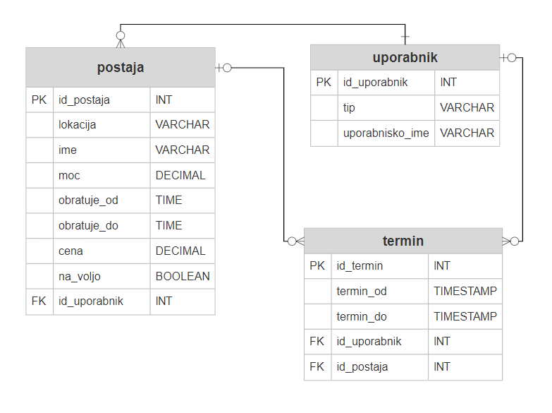

# Polnilne-postaje

Za zagon PostgreSQL podatkovne baze znotraj Docker okolja uporabimo naslednji ukaz:

`docker run -d --name PolnilnePostaje -e POSTGRES_PASSWORD=postgres -e POSTGRES_DB=polnilnepostaje -p 5432:5432 postgres:13`

Za prevajanje aplikacije uporabimo ukaz: `mvn clean package`

Za izvajanje dobljene .jar datoteke uporabimo ukaz: `java -jar .\api\target\api-1.0.0-SNAPSHOT.jar`

## Podatkovni model



## Keycloak (how to)

* Naslednjo json strukturo shranimo v realm-export.json

<details>
<summary>realm-export.json</summary>
<p>

```json

```

</p>
</details>  

* Ustvarimo Docker vsebnik z ukazom:
`docker run --name Keycloak -e KEYCLOAK_USER=admin -e KEYCLOAK_PASSWORD=admin -e KEYCLOAK_IMPORT=/C/Users/adnan/Desktop/realm-export.json -v /C/Users/adnan/Desktop/realm-export.json:/C/Users/adnan/Desktop/realm-export.json -p 8082:8080 jboss/keycloak`
* V Keycloak admin panelu na naslovu http://localhost:8082 dodati uporabnika **admin** s geslom **admin** in mu dodeliti **admin** in **user** pravice
* Z orodjem curl pridobimo token za avtentikacijo: `curl -X POST http://localhost:8082/auth/realms/polnilnepostaje-realm/protocol/openid-connect/token -H 'content-type: application/x-www-form-urlencoded' -d 'grant_type=password&client_id=polnilnepostaje-app&username=admin&password=admin'
  `
* Naredimo request v orodju curl ali Postman z ustrezimi parametri:
`curl -X GET http://localhost:8080/v1/upravljanje/postaje/1 -H 'authorization: Bearer >>TOKEN<< -H 'content-type: application/json'`